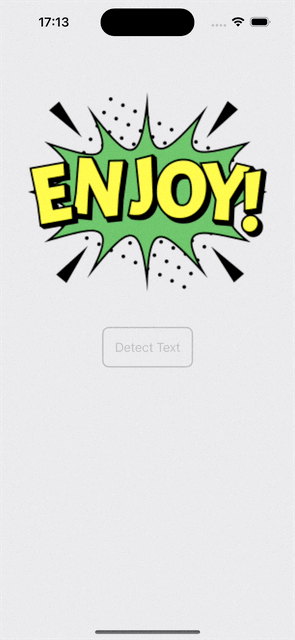
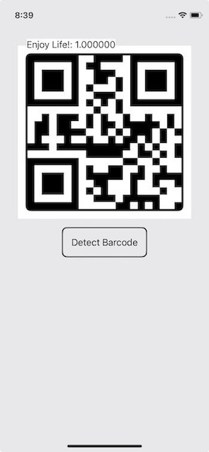
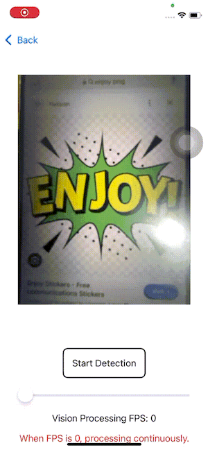
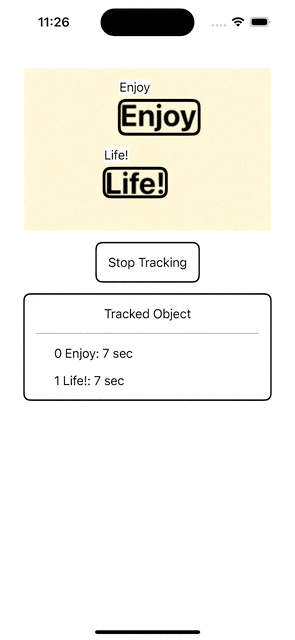

# Vision Demo
An App demoing on how to use [Vision](https://developer.apple.com/documentation/vision) framework for object detection.

**Beta features (and ONLY beta features) used**
- [VisionRequest](https://developer.apple.com/documentation/vision/visionrequest)
- [VisionResult](https://developer.apple.com/documentation/vision/visionresult)
- [VisionObservation](https://developer.apple.com/documentation/vision/visionobservation)

and classes implements the protocals above. 

## Prerequisite
- [Xcode 16 beta](https://developer.apple.com/download)
- iOS 18 running on real device.

## Object Detection in Still Image
Examples on Text detection, Barcode detection, and a combination of both.

For further details, check out [SwiftUI+Vision: Object Detection in Still Image](https://medium.com/@itsuki.enjoy/swiftui-vision-object-detection-in-still-image-61654fa6e6cd).

## Object Detection in Live Capture
An example on Live Text detection and recognition.

For further details, check out [SwiftUI+Vision: Object Detection in Live Capture](https://medium.com/@itsuki.enjoy/swiftui-vision-object-detection-in-live-capture-ca9f0da3c862).

## Object Tracking with Custom Algorithm
**Tracking using custom [Centroid Tracker](./VisionDemo/Manager/CentroidTracker.swift)**

Example on Text detection, recognition and tracking.

For further details, check out [SwiftUI+Vision: Custom Object Tracking using Centroid Tracking Algorithm](https://medium.com/@itsuki.enjoy/swiftui-vision-object-tracker-using-centroid-tracking-algorithm-02faf0132f92).
