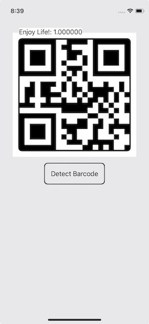

# Vision Demo
An App demoing on how to use [Vision](https://developer.apple.com/documentation/vision) framework for object detection.

**Beta features (and ONLY beta features) used**
- [VisionRequest](https://developer.apple.com/documentation/vision/visionrequest)
- [VisionResult](https://developer.apple.com/documentation/vision/visionresult)
- [VisionObservation](https://developer.apple.com/documentation/vision/visionobservation)

and classes implements the protocals above.

## Object Detection in Still Image
Examples on Text detection, Barcode detection, and a combination of both.

For further details, check out [SwiftUI: Create App-Specific Custom Keyboard](https://medium.com/@itsuki.enjoy/swiftui-create-app-specific-custom-keyboard-e080b4378029).

## Object Detection in Live Capture
An example on Live Text detection and recognition.

